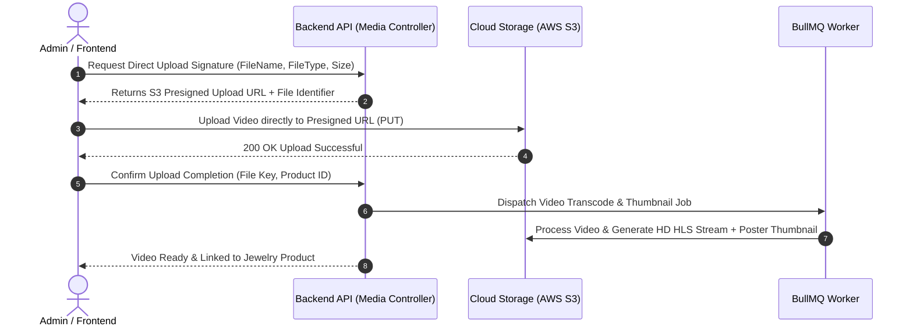

# Swariya Jewellery Backend - System Architecture Document

## 1. Technology Stack Selection

| Component | Technology | Rationale |
| :--- | :--- | :--- |
| **Language & Runtime** | Node.js (v20+ LTS) ES Modules (`"type": "module"`) | Fast asynchronous execution, identical to Shikshatam backend architecture. |
| **Web Framework** | Express.js | Standardized modular controllers, routes, and middlewares. |
| **Database & ORM** | MongoDB + Mongoose | Document database providing flexibility for jewelry specifications and order snapshots. |
| **Request Validation** | Joi + schemaValidator middleware | Automated payload validation mapping via `validators/index.js`. |
| **Payment Gateway** | Cashfree Payment Gateway | Cashfree Checkout SDK & webhook HMAC SHA-256 signature processing. |
| **Documentation** | Swagger / OpenAPI 3.0 | Auto-generated interactive API documentation for frontend and mobile apps. |

---

## 2. High-Level Architecture Diagram

```mermaid
graph TD
    Client[Mobile App / React Web Storefront] --> API_Gateway[Nginx Reverse Proxy / Load Balancer]
    AdminWeb[Admin Dashboard SPA] --> API_Gateway

    API_Gateway --> Middleware[Express Middleware Layer\n(Auth, CORS, Rate-Limit, Helmet)]
    Middleware --> Controllers[API Controllers Module]

    subgraph "Modular Core Services"
        Controllers --> AuthSvc[Auth & RBAC Service]
        Controllers --> CatalogSvc[Catalog & Category Service]
        Controllers --> PricingSvc[Dynamic Price Calculation Engine]
        Controllers --> MediaSvc[Video & Image Upload Service]
        Controllers --> EnquirySvc[Customer Enquiry Service]
        Controllers --> OrderSvc[Order & Checkout Service]
        Controllers --> PaymentSvc[Transaction & Webhook Service]
    end

    subgraph "Data & Async Layer"
        PricingSvc <--> Redis[(Redis Cache\n- Live Gold Rates\n- Session/Cart)]
        CatalogSvc <--> Postgres[(PostgreSQL Primary Database)]
        OrderSvc <--> Postgres
        PaymentSvc <--> Postgres
        
        MediaSvc --> S3[AWS S3 Bucket / CDN]
        OrderSvc --> Queue[BullMQ Event Queue]
        Queue --> Worker[Async Background Workers\n(Video Processing, Email, Invoices)]
    end

    subgraph "Third Party Integrations"
        PricingSvc --> MetalAPI[Gold Rate API / Manual Override]
        PaymentSvc --> Gateway[Razorpay / Stripe Payment API]
        Worker --> SMTP[Nodemailer / AWS SES]
    end
```

---

## 3. Core Software Modules & Layered Architecture

The application follows a **Clean Layered Architecture (Controller-Service-Repository Pattern)** to decouple business logic from HTTP protocols and data persistence:

```
src/
├── config/             # Environment, Database, Redis, S3, Cloudinary configs
├── constants/          # Enums, Http Status codes, Error Messages
├── controllers/        # Express Request handlers (Input validation, HTTP response)
│   ├── auth.controller.ts
│   ├── category.controller.ts
│   ├── product.controller.ts
│   ├── media.controller.ts
│   ├── enquiry.controller.ts
│   ├── order.controller.ts
│   └── transaction.controller.ts
├── middlewares/        # Authentication, Authorization RBAC, Rate limiting, Error Handling
├── models / prisma/    # Database Schema definitions & Prisma client instance
├── queues/             # BullMQ workers for async background jobs (video/email)
├── routes/             # Express Router specs matching versioned API endpoints
├── services/           # Pure Business Logic Layer (Pricing, Orders, Auth validation)
├── utils/              # Helper functions (S3 presigned URLs, Razorpay signature, JWT)
└── app.ts              # Express application bootstrap
```

---

## 4. Media & Video Upload Architecture

High-definition video uploads (360-degree jewelry view) require an asynchronous direct-to-cloud upload pipeline to keep backend servers scalable:



---

## 5. Security & Data Protection Architecture

1. **Authentication**: JWT access tokens (short lived, 15 min) + HttpOnly Refresh Cookies (7 days).
2. **Password Security**: Bcrypt algorithm with salt factor 12.
3. **Role-Based Authorization (RBAC)**: Centralized middleware enforcing granular permissions per route.
4. **Data Encryption**: TLS 1.3 in transit, AES-256 for database backups and media storage.
5. **Payment Webhook Verification**: Cryptographic HMAC-SHA256 signature verification for all payment callbacks.
6. **Input Sanitization**: Strict schema validation using Zod on every incoming HTTP payload.
