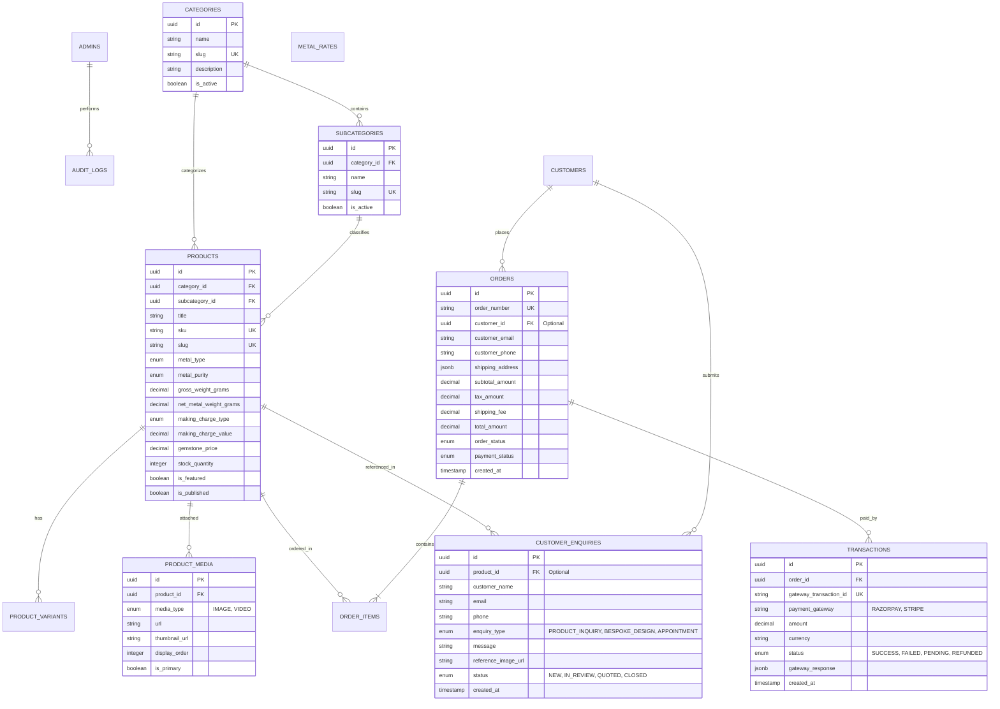

# Swariya Jewellery Backend - Database Schema & API Specifications

## 1. Database Entity-Relationship Diagram (ERD)



---

## 2. PostgreSQL Relational Database Schema Definitions

### 2.1 Table: `admins`
```sql
CREATE TYPE admin_role AS ENUM ('SUPER_ADMIN', 'INVENTORY_MANAGER', 'ORDER_MANAGER', 'CUSTOMER_SUPPORT');

CREATE TABLE admins (
    id UUID PRIMARY KEY DEFAULT gen_random_uuid(),
    full_name VARCHAR(100) NOT NULL,
    email VARCHAR(150) UNIQUE NOT NULL,
    password_hash VARCHAR(255) NOT NULL,
    role admin_role NOT NULL DEFAULT 'INVENTORY_MANAGER',
    is_active BOOLEAN DEFAULT TRUE,
    created_at TIMESTAMP WITH TIME ZONE DEFAULT CURRENT_TIMESTAMP,
    updated_at TIMESTAMP WITH TIME ZONE DEFAULT CURRENT_TIMESTAMP
);
```

### 2.2 Table: `categories` & `subcategories`
```sql
CREATE TABLE categories (
    id UUID PRIMARY KEY DEFAULT gen_random_uuid(),
    name VARCHAR(100) NOT NULL,
    slug VARCHAR(120) UNIQUE NOT NULL,
    description TEXT,
    banner_image_url TEXT,
    is_active BOOLEAN DEFAULT TRUE,
    created_at TIMESTAMP WITH TIME ZONE DEFAULT CURRENT_TIMESTAMP
);

CREATE TABLE subcategories (
    id UUID PRIMARY KEY DEFAULT gen_random_uuid(),
    category_id UUID NOT NULL REFERENCES categories(id) ON DELETE CASCADE,
    name VARCHAR(100) NOT NULL,
    slug VARCHAR(120) UNIQUE NOT NULL,
    description TEXT,
    is_active BOOLEAN DEFAULT TRUE,
    created_at TIMESTAMP WITH TIME ZONE DEFAULT CURRENT_TIMESTAMP
);
```

### 2.3 Table: `metal_rates`
```sql
CREATE TYPE metal_enum AS ENUM ('GOLD', 'SILVER', 'PLATINUM');
CREATE TYPE purity_enum AS ENUM ('14K', '18K', '22K', '24K', 'SILVER_925');

CREATE TABLE metal_rates (
    id UUID PRIMARY KEY DEFAULT gen_random_uuid(),
    metal_type metal_enum NOT NULL,
    purity purity_enum NOT NULL,
    rate_per_gram DECIMAL(10, 2) NOT NULL,
    updated_by UUID REFERENCES admins(id),
    effective_from TIMESTAMP WITH TIME ZONE DEFAULT CURRENT_TIMESTAMP,
    CONSTRAINT unique_metal_purity UNIQUE (metal_type, purity)
);
```

### 2.4 Table: `products` & `product_media`
```sql
CREATE TYPE charge_type_enum AS ENUM ('PERCENTAGE', 'FLAT_PER_GRAM');

CREATE TABLE products (
    id UUID PRIMARY KEY DEFAULT gen_random_uuid(),
    category_id UUID NOT NULL REFERENCES categories(id),
    subcategory_id UUID REFERENCES subcategories(id),
    title VARCHAR(200) NOT NULL,
    slug VARCHAR(220) UNIQUE NOT NULL,
    sku VARCHAR(80) UNIQUE NOT NULL,
    description TEXT NOT NULL,
    metal_type metal_enum NOT NULL,
    metal_purity purity_enum NOT NULL,
    gross_weight_grams DECIMAL(8, 3) NOT NULL,
    net_metal_weight_grams DECIMAL(8, 3) NOT NULL,
    making_charge_type charge_type_enum NOT NULL DEFAULT 'PERCENTAGE',
    making_charge_value DECIMAL(10, 2) NOT NULL,
    gemstone_price DECIMAL(12, 2) DEFAULT 0.00,
    stock_quantity INT NOT NULL DEFAULT 0,
    is_featured BOOLEAN DEFAULT FALSE,
    is_published BOOLEAN DEFAULT TRUE,
    created_at TIMESTAMP WITH TIME ZONE DEFAULT CURRENT_TIMESTAMP,
    updated_at TIMESTAMP WITH TIME ZONE DEFAULT CURRENT_TIMESTAMP
);

CREATE TYPE media_type_enum AS ENUM ('IMAGE', 'VIDEO');

CREATE TABLE product_media (
    id UUID PRIMARY KEY DEFAULT gen_random_uuid(),
    product_id UUID NOT NULL REFERENCES products(id) ON DELETE CASCADE,
    media_type media_type_enum NOT NULL,
    url TEXT NOT NULL,
    thumbnail_url TEXT,
    display_order INT DEFAULT 0,
    is_primary BOOLEAN DEFAULT FALSE,
    created_at TIMESTAMP WITH TIME ZONE DEFAULT CURRENT_TIMESTAMP
);
```

### 2.5 Table: `customer_enquiries`
```sql
CREATE TYPE enquiry_type_enum AS ENUM ('PRODUCT_INQUIRY', 'BESPOKE_DESIGN', 'APPOINTMENT');
CREATE TYPE enquiry_status_enum AS ENUM ('NEW', 'IN_REVIEW', 'QUOTED', 'CLOSED');

CREATE TABLE customer_enquiries (
    id UUID PRIMARY KEY DEFAULT gen_random_uuid(),
    product_id UUID REFERENCES products(id) ON DELETE SET NULL,
    customer_name VARCHAR(120) NOT NULL,
    email VARCHAR(150) NOT NULL,
    phone VARCHAR(20) NOT NULL,
    enquiry_type enquiry_type_enum NOT NULL DEFAULT 'PRODUCT_INQUIRY',
    message TEXT NOT NULL,
    reference_image_url TEXT,
    status enquiry_status_enum DEFAULT 'NEW',
    assigned_admin_id UUID REFERENCES admins(id),
    created_at TIMESTAMP WITH TIME ZONE DEFAULT CURRENT_TIMESTAMP
);
```

### 2.6 Table: `orders`, `order_items`, & `transactions`
```sql
CREATE TYPE order_status_enum AS ENUM ('PENDING_PAYMENT', 'PAID', 'IN_PRODUCTION', 'READY_TO_SHIP', 'SHIPPED', 'DELIVERED', 'CANCELLED');
CREATE TYPE payment_status_enum AS ENUM ('PENDING', 'PAID', 'FAILED', 'REFUNDED');

CREATE TABLE orders (
    id UUID PRIMARY KEY DEFAULT gen_random_uuid(),
    order_number VARCHAR(50) UNIQUE NOT NULL,
    customer_email VARCHAR(150) NOT NULL,
    customer_phone VARCHAR(20) NOT NULL,
    shipping_address JSONB NOT NULL,
    subtotal_amount DECIMAL(12, 2) NOT NULL,
    tax_amount DECIMAL(12, 2) NOT NULL,
    shipping_fee DECIMAL(10, 2) DEFAULT 0.00,
    total_amount DECIMAL(12, 2) NOT NULL,
    order_status order_status_enum DEFAULT 'PENDING_PAYMENT',
    payment_status payment_status_enum DEFAULT 'PENDING',
    created_at TIMESTAMP WITH TIME ZONE DEFAULT CURRENT_TIMESTAMP
);

CREATE TABLE order_items (
    id UUID PRIMARY KEY DEFAULT gen_random_uuid(),
    order_id UUID NOT NULL REFERENCES orders(id) ON DELETE CASCADE,
    product_id UUID NOT NULL REFERENCES products(id),
    product_title VARCHAR(200) NOT NULL,
    sku VARCHAR(80) NOT NULL,
    unit_price DECIMAL(12, 2) NOT NULL,
    quantity INT NOT NULL,
    total_price DECIMAL(12, 2) NOT NULL
);

CREATE TABLE transactions (
    id UUID PRIMARY KEY DEFAULT gen_random_uuid(),
    order_id UUID NOT NULL REFERENCES orders(id),
    gateway_transaction_id VARCHAR(100) UNIQUE NOT NULL,
    payment_gateway VARCHAR(50) NOT NULL,
    amount DECIMAL(12, 2) NOT NULL,
    currency VARCHAR(10) DEFAULT 'INR',
    status VARCHAR(30) NOT NULL,
    gateway_response JSONB,
    created_at TIMESTAMP WITH TIME ZONE DEFAULT CURRENT_TIMESTAMP
);
```

---

## 3. RESTful API Endpoint Specifications

### 3.1 Authentication Endpoints
- **`POST /api/v1/auth/admin/login`**
  - Payload: `{ "email": "admin@swariya.com", "password": "SecurePassword123" }`
  - Response: `{ "status": "success", "token": "JWT_ACCESS_TOKEN", "user": { "id": "...", "role": "SUPER_ADMIN" } }`

### 3.2 Category & Subcategory Endpoints
- **`GET /api/v1/categories`** - Fetch all categories with subcategories tree.
- **`POST /api/v1/categories`** *(Admin)* - Create category.
- **`POST /api/v1/categories/:id/subcategories`** *(Admin)* - Add subcategory.

### 3.3 Product Catalog Endpoints
- **`POST /api/v1/products`** *(Admin)* - Create new jewelry product with weights, purity, making charges.
- **`GET /api/v1/products`** - Search & filter products (by category, metal_type, purity, weight range, price range).
- **`GET /api/v1/products/:slug`** - Get product details with dynamic price calculated against current metal rates.
- **`PUT /api/v1/products/:id`** *(Admin)* - Update product.
- **`DELETE /api/v1/products/:id`** *(Admin)* - Soft delete/archive product.

### 3.4 Media & Video Upload Endpoints
- **`POST /api/v1/media/upload-url`** *(Admin)*
  - Payload: `{ "fileName": "ring-360.mp4", "fileType": "video/mp4", "productId": "UUID" }`
  - Response: `{ "uploadUrl": "https://s3.amazonaws.com/...", "mediaId": "UUID" }`
- **`POST /api/v1/media/confirm`** *(Admin)* - Trigger video thumbnailing & link media to product.

### 3.5 Customer Enquiry Endpoints
- **`POST /api/v1/enquiries`** - Submit product or bespoke design inquiry (with reference image upload).
- **`GET /api/v1/admin/enquiries`** *(Admin)* - List inquiries with filtering by status.
- **`PATCH /api/v1/admin/enquiries/:id/status`** *(Admin)* - Update inquiry workflow status & assign team member.

### 3.6 Order & Checkout Endpoints
- **`POST /api/v1/orders/checkout`** - Initiate checkout & calculate total taxes and insured shipping fee.
- **`GET /api/v1/orders/:orderNumber`** - Track order status.
- **`PATCH /api/v1/admin/orders/:id/status`** *(Admin)* - Update fulfillment state (e.g. `PAID` → `IN_PRODUCTION`).

### 3.7 Transaction & Payment Endpoints
- **`POST /api/v1/payments/create-razorpay-order`** - Create gateway order ID for frontend SDK initiation.
- **`POST /api/v1/payments/webhook/razorpay`** - Secure webhook endpoint verifying payment HMAC signature.
