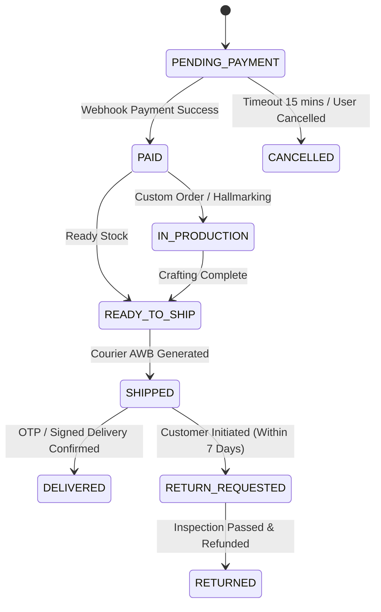

# Swariya Jewellery Backend - Business Rules & Domain Validation Guidelines

## 1. Domain Business Logic Rules

### 1.1 Gold & Silver Dynamic Pricing Rules
1. **Live Rate Cache**: Gold and Silver base rates per gram are retrieved from Redis. If cache misses, fallback to DB configuration table.
2. **Formula Integrity**:
   - Gross Weight = Net Metal Weight + Gemstone Weight.
   - **Validation Constraint**: `Gross Weight` MUST BE $\ge$ `Net Metal Weight`.
   - `Metal Base Price` = $\text{Net Metal Weight (grams)} \times \text{Current Live Rate for specific Purity}$.
   - `Making Charges`:
     - If `MakingChargeType == PERCENTAGE`: $\text{Metal Base Price} \times (\frac{\text{MakingChargeValue}}{100})$
     - If `MakingChargeType == FLAT_PER_GRAM`: $\text{Net Metal Weight} \times \text{MakingChargeValue}$
   - `Subtotal` = $\text{Metal Base Price} + \text{Making Charges} + \text{Total Gemstone Cost}$.
   - `Tax (GST)` = $\text{Subtotal} \times 0.03$ (Standard 3% GST on Gold Jewelry).
   - `Final Selling Price` = $\text{Subtotal} + \text{Tax}$.

### 1.2 Metal Purity Factor Standards
- `24K Gold`: $99.9\%$ Purity multiplier $1.000$
- `22K Gold`: $91.6\%$ Purity multiplier $0.916$
- `18K Gold`: $75.0\%$ Purity multiplier $0.750$
- `14K Gold`: $58.3\%$ Purity multiplier $0.583$
- `925 Sterling Silver`: $92.5\%$ Purity multiplier $0.925$

---

## 2. Media & Video Upload Validation Rules

1. **Allowed MIME Types**:
   - Images: `image/jpeg`, `image/png`, `image/webp` (Max size: 10MB per image).
   - Videos: `video/mp4`, `video/webm`, `video/quicktime` (Max size: 50MB per video).
2. **Video Aspect Ratios**: Recommended 1:1 (Square) for product gallery cards and 9:16 (Vertical) for 360-degree interactive viewer reels.
3. **Thumbnail Requirement**: Every uploaded video MUST have an auto-generated poster image thumbnail created during background ingestion.

---

## 3. Order Lifecycle State Machine & Stock Rules

### 3.1 Inventory Allocation Rules
- When an order is created (`PENDING_PAYMENT`), inventory count is soft-reserved for **15 minutes**.
- If payment succeeds within 15 minutes, stock reservation is locked permanently.
- If payment fails or times out, soft-reserved stock is returned to available stock via scheduled Redis job.

---

## 4. Customer Enquiry & Spam Prevention Rules

1. **Rate Limiting**: Maximum 3 customer enquiries per IP address per 60 minutes.
2. **Mandatory Fields for Bespoke Enquiry**: Customer Name, Phone Number (E.164 format), Email, Metal Preference, Estimated Budget.
3. **Notification Routing**: New enquiries trigger an instant notification in the Admin Portal and send an email alert to the Sales Team.

---

## 5. Security & Administrative Audit Rules

1. **Super Admin Authorization**: Password resets for administrative staff can ONLY be performed by `SUPER_ADMIN`.
2. **Audit Logging**: Any update to the **Live Metal Rate**, **Manual Price Overrides**, or **Order Refunds** MUST create an immutable log entry in the `audit_logs` database table capturing `AdminID`, `IP Address`, `Old Value`, and `New Value`.
3. **Idempotency**: All payment webhook processing MUST be idempotent using Gateway Transaction ID as unique constraint to prevent duplicate credits.
